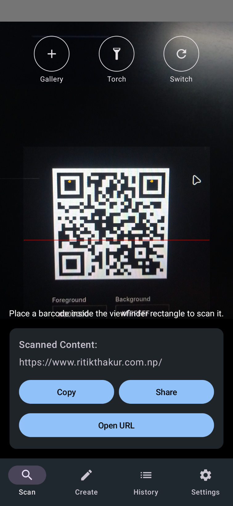
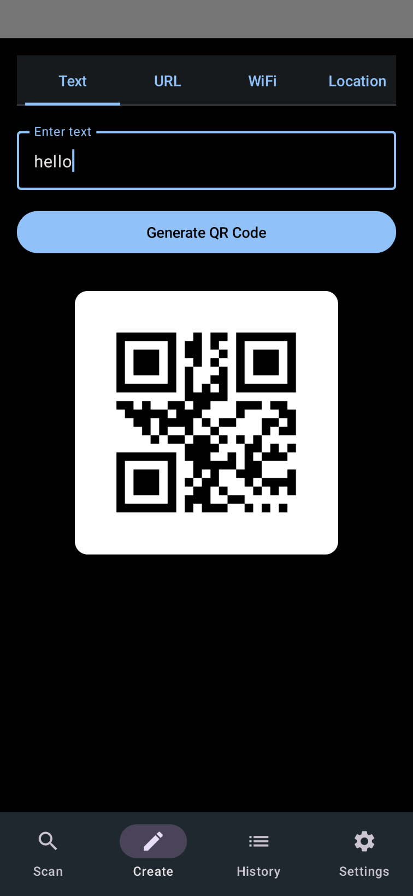
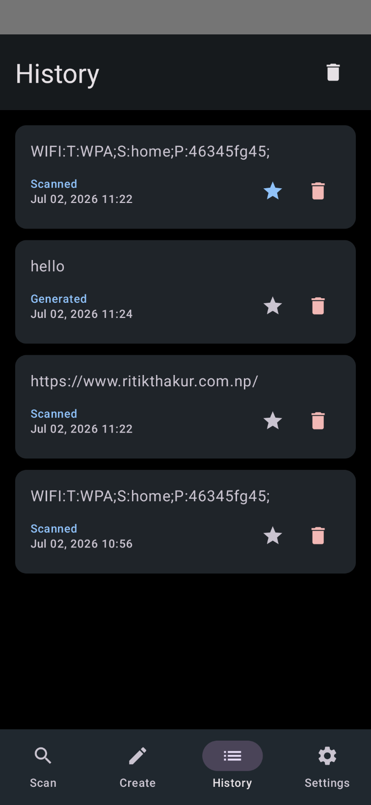
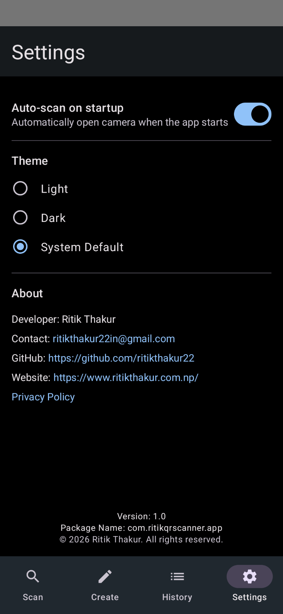

# QR Scanner & Reader [No ADs]

A fast, modern, and completely ad-free QR Scanner and Barcode Reader built natively for Android using Jetpack Compose. Designed with a minimal UI and smooth user experience, it features dynamic light and dark modes, seamless Wi-Fi auto-connect, and comprehensive history management.

## 🌟 Features
- **Lightning Fast Scanning**: Instantly decode standard QR codes, barcodes, and URLs.
- **Modern UI/UX**: Clean, minimalist design using Jetpack Compose with beautiful dynamic Light and Dark mode themes.
- **Smart Actions**: 
  - Automatically detect and connect to Wi-Fi networks from QR codes (supports Android 10+ and legacy APIs).
  - Open URLs directly in the browser.
  - Smart copy-to-clipboard functionality.
- **Upload from Gallery**: Scan QR codes from images saved on your device.
- **Torch Control**: Easily toggle the camera flashlight for scanning in low-light environments.
- **History Management**: Automatically save scanned items. Pin important codes to the top, or selectively delete history items.
- **No Ads, No Trackers**: 100% privacy-focused.
- **Fully Offline**: Does not require an internet connection to scan and decode.

## 📸 Screenshots

### Light Theme
| Scanner | Result | History | Settings |
| :---: | :---: | :---: | :---: |
|  |  |  |  |

### Dark Theme
| Scanner | Result | History | Settings |
| :---: | :---: | :---: | :---: |
|  |  |  |  |

## 💻 Tech Stack
- **Language**: Kotlin
- **UI Framework**: Jetpack Compose & Material Design 3
- **Database**: Room (SQLite) & Jetpack DataStore (Preferences)
- **Architecture**: MVVM, Compose Navigation
- **Image Loading**: Coil
- **QR Core Engine**: ZXing (Zebra Crossing)

## 🛠️ How to Build from Source
Anyone can clone and build this application locally using Android Studio.

### Prerequisites
- **Android Studio** (Jellyfish or newer recommended)
- **JDK 17** or newer
- **Android SDK** API level 34

### Build Instructions
1. **Clone the repository**:
   ```bash
   git clone https://github.com/ritikthakur22/QRScannerReader.git
   cd QRScannerReader
   ```
2. **Open the project**:
   Open Android Studio -> `File` -> `Open...` and select the project directory.
3. **Sync Gradle**:
   Allow Android Studio to download dependencies and sync the Gradle files.
4. **Build the APK**:
   ```bash
   # Build a debug APK
   ./gradlew assembleDebug

   # Build a release Android App Bundle (AAB) for Play Store
   ./gradlew bundleRelease
   ```
5. **Install on Device**:
   ```bash
   ./gradlew installDebug
   ```

## 🐛 Bug Fixes & Improvements
- **Wi-Fi Connection Stability**: Fixed issues with legacy parsing and improved connection handling for both Android 10+ (using `WifiNetworkSuggestion`/`WifiNetworkSpecifier`) and older devices (using legacy `WifiManager`).
- **Dark Mode Theming**: Resolved hardcoded colors that broke UI visibility in dark mode. Complete migration to Material Theme ColorSchemes.
- **Manifest Routing**: Fixed `ClassNotFoundException` on app startup caused by namespace refactoring mismatches.
- **UI Enhancements**: Restructured the scanner screen overlay with explicit icons (Torch, Gallery, Switch Camera) matching the modern aesthetic.

## 🔐 App Permissions
To provide its functionality, the app requires the following permissions:
- `android.permission.CAMERA`: Required to scan QR codes and barcodes.
- `android.permission.VIBRATE`: Provides haptic feedback upon successful scan.
- `android.permission.INTERNET`: Used only for opening scanned URLs in the external browser.
- `android.permission.ACCESS_WIFI_STATE` & `CHANGE_WIFI_STATE`: Required to automatically connect to scanned Wi-Fi networks.
- `android.permission.ACCESS_FINE_LOCATION`: Required by Android system for Wi-Fi connection capabilities on certain API levels.

## 👨‍💻 Developer Details
- **Developer**: Ritik Thakur
- **Contact**: [ritikthakur22in@gmail.com](mailto:ritikthakur22in@gmail.com)
- **GitHub**: [ritikthakur22](https://github.com/ritikthakur22)
- **Website**: [www.ritikthakur.com.np](https://www.ritikthakur.com.np/)
- **Privacy Policy**: [Read Here](https://docs.google.com/document/d/1lsuML4n8tc4_V2ltfkkAxb57SFENPnabYSzk9h829mc/edit?usp=sharing)

## 📄 License
© 2026 Ritik Thakur. All rights reserved.
